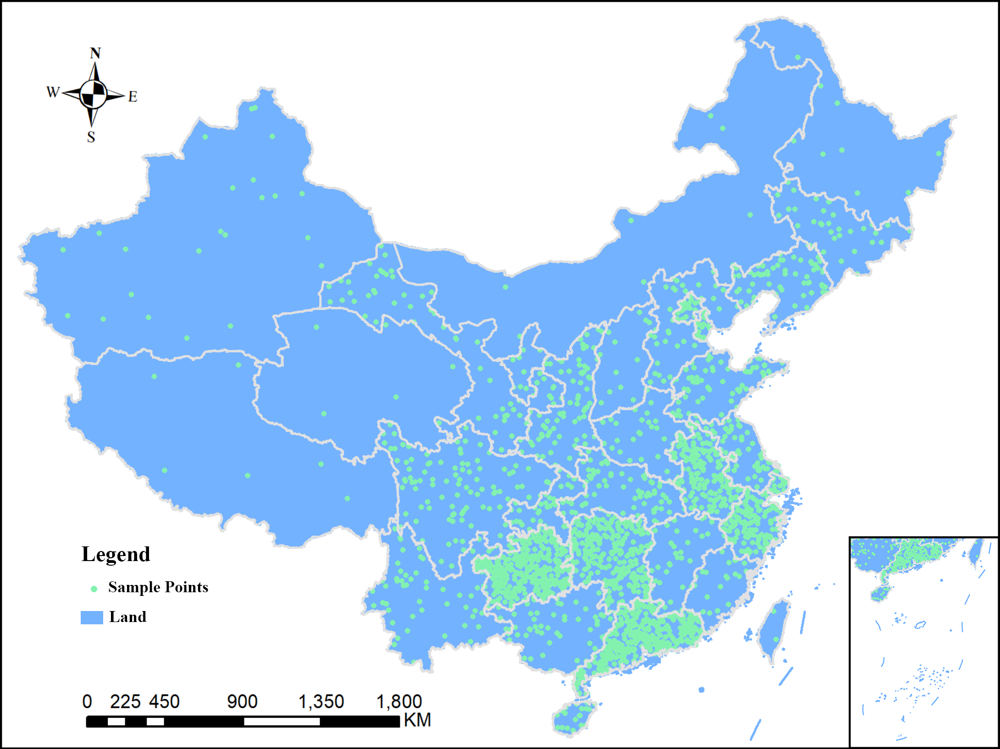
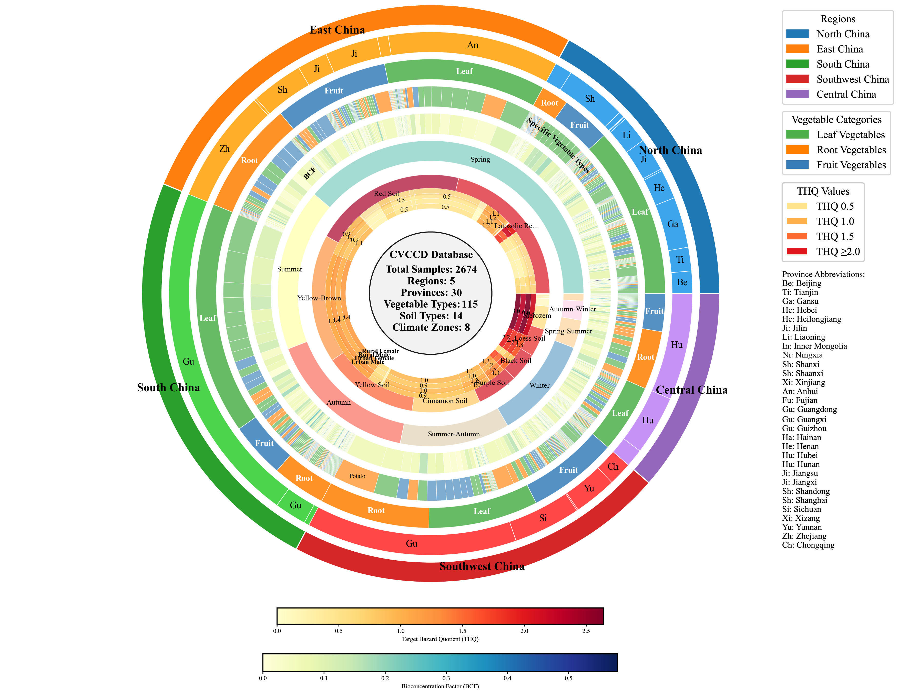
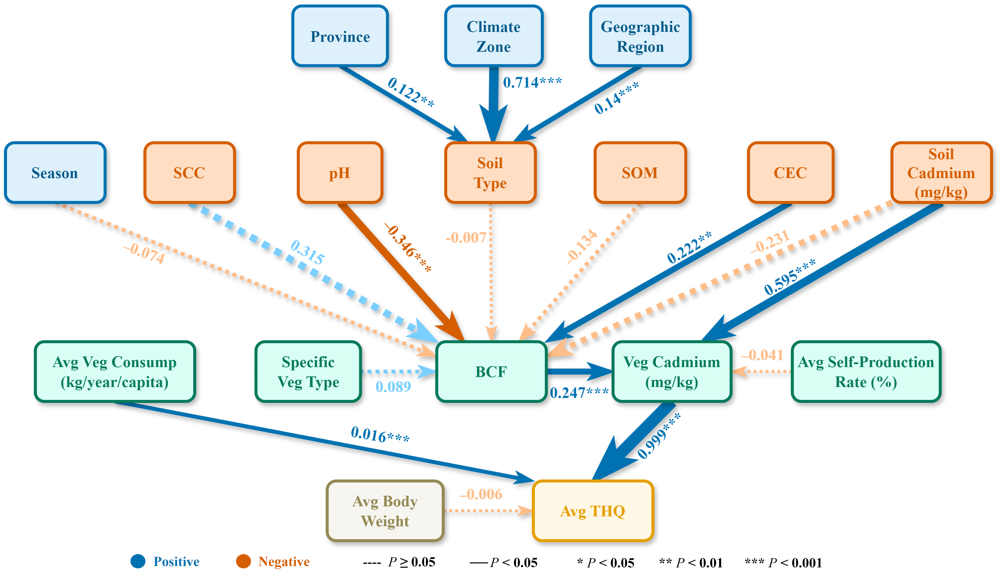
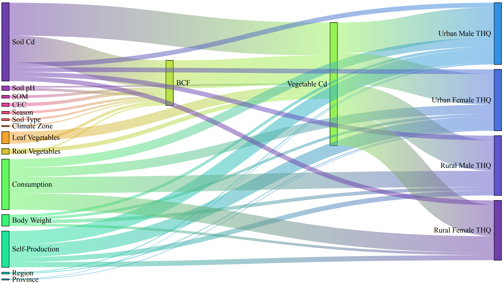
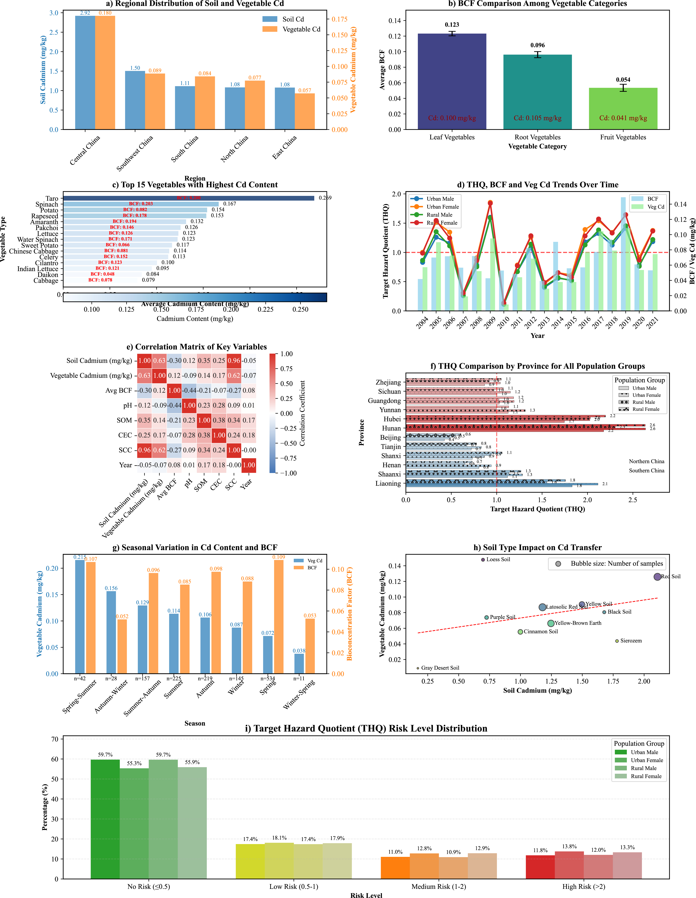
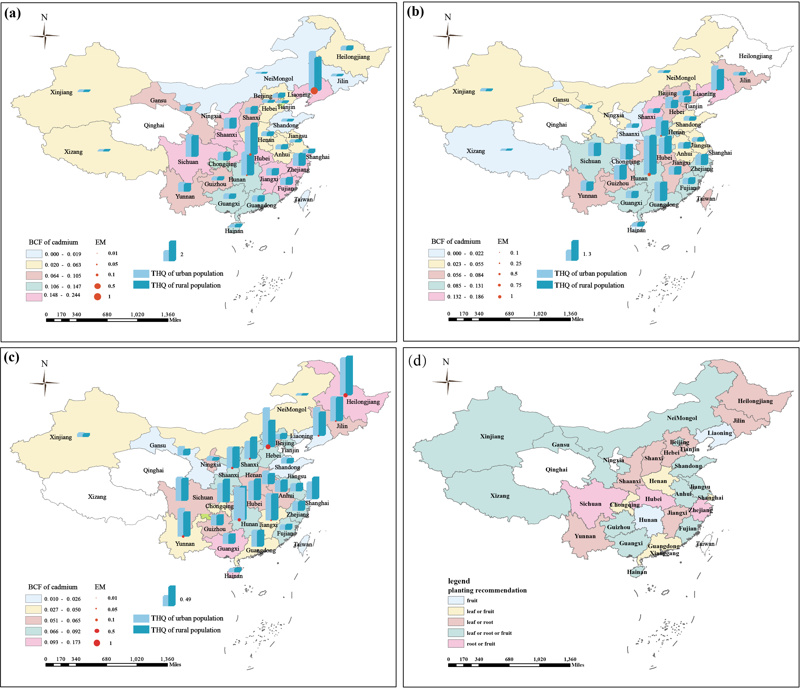

## 🏢 Institution

This project was developed at the:  
a Hunan Provincial University Key Laboratory for Environmental and Ecological Health, Hunan Provincial University Key Laboratory for Environmental Behavior and Control Principle of New Pollutants, College of Environment and Resources, Xiangtan University, Xiangtan 411105, China
b National Center for Applied Mathematics in Hunan, the Key Laboratory of Intelligent Computing and Information Processing of the Ministry of Education, at School of Mathematics and Computational Science, Xiangtan University, Xiangtan 411105, China

# Comprehensive Database of Cadmium Pollution in Chinese Vegetables and Human Health Risks (CVCCD)

This repository hosts the **Chinese Vegetable Cadmium Contamination Database (CVCCD)**, a comprehensive, interactive web-based platform designed for the exploration and analysis of cadmium (Cd) pollution in vegetables across China and its associated human health risks.

This platform serves as a powerful academic tool for researchers, policymakers, and the public to query, visualize, and understand the complex dynamics of cadmium contamination in the food chain.

**Access the Live Database:** [**CVCCD Interactive Website**](./CVCCD.html)

---

## 🖼️ Research Gallery Highlights

This project includes key data visualizations derived from our comprehensive research, providing insights into the spatial distribution, risk factors, and mechanisms of cadmium contamination.

| Figure 1: Data Point Distribution | Figure 2: Database Structure Topology | Figure 3: Health Risk Pathway Analysis |
| :---: | :---: | :---: |
|  |  |  |
| *Spatial distribution of sampling points for Cd pollution in vegetables across various provinces in China.* | *A circular diagram illustrating the database structure and relationships between different data elements.* | *A path analysis diagram showing the interrelationships of factors influencing vegetable Cd content and human health risks.* |

| Figure 4: Health Risk Flow Mechanism | Figure 5: CVCCD Risk Assessment | Figure 6: Major Vegetable Category Distribution |
| :---: | :---: | :---: |
|  |  |  |
| *A Sankey diagram visualizing the flow mechanism from vegetable Cd pollution to human health risks.* | *A comprehensive analysis of risk assessment based on the China Vegetable Cadmium Contamination Database.* | *The distribution ratio of different vegetable categories within the database.* |

---

## ✨ Features

The CVCCD platform offers a rich set of interactive features for in-depth data analysis:

-   **Interactive Data Filtering:** Users can dynamically filter the extensive dataset by multiple criteria, including:
    -   Province
    -   Major Vegetable Category
    -   Specific Vegetable Type
    -   Soil Type
    -   Climate Zone
-   **Keyword Search:** A powerful search function allows for querying across all data fields to quickly locate specific records.
-   **Real-time Statistical Analysis:** An interactive dashboard that automatically calculates and displays key statistics based on the currently filtered data, including:
    -   Average, range, and sample size for Soil Cd, Vegetable Cd, pH, SOM, and CEC.
    -   Aggregated Target Hazard Quotient (THQ) values for different population groups (Urban/Rural, Male/Female).
-   **Dynamic Data Visualization:** A suite of interactive charts, powered by Chart.js, that update in real-time as filters are applied:
    -   Regional Soil vs. Vegetable Cd Content
    -   Bioconcentration Factor (BCF) by Vegetable Category
    -   Top 15 Vegetables with the Highest Cd Content
    -   Time-series Trends for THQ, BCF, and Cd Levels
    -   Provincial THQ Risk Comparison
    -   Impact of Season and Soil Type on Cadmium Transfer
-   **Paginated Data Table:** A clean and responsive table for viewing raw data, with easy-to-use pagination controls.
-   **Excel Data Import:** Users can upload their own `.xlsx` or `.xls` files to instantly visualize and analyze their datasets using the platform's tools.

---

## 🛠️ Technical Overview

-   **Frontend:** The entire platform is a self-contained single-page application built with vanilla **HTML, CSS, and JavaScript**.
-   **Data Visualization:** All charts are rendered using the powerful and flexible **[Chart.js](https://www.chartjs.org/)** library.
-   **Excel Parsing:** Client-side Excel file reading and parsing is handled by the **[SheetJS (xlsx.js)](https://sheetjs.com/)** library.
-   **Deployment:** The application is a static website that can be hosted on any web server or opened directly from the local file system.

---

## 🚀 How to Use

### Online
Simply click on the [**CVCCD.html**](./CVCCD.html) file in this repository. GitHub will render it as a webpage automatically.

### Local
1.  Clone or download this repository to your local machine.
2.  Navigate to the repository's directory.
3.  Double-click the `CVCCD.html` file to open it in your preferred web browser (e.g., Chrome, Firefox, Edge).

---

## 📜 License

This project is licensed under the MIT License. See the [LICENSE](./LICENSE) file for details.

---

---

> © 2025 CVCCD-Database Project. All data is intended for academic research purposes only.
